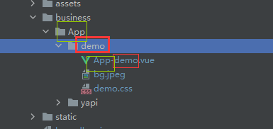

- 约定 App 目录的子目录为独立应用，对应 app-entry-name=》aen。
- 应用名称小写
- 约定 App-xxx 为入口视图名称

## 加载逻辑和流程

.1 demo 本身就是视图
.1 yapi 在 App-yapi.vue 文件中加载路由，然后跳转默认路由，setup的render函数返回的是null


## Projects

>[Yapi](./README.boundless.yapi.md);

## 常用辅助函数

```js
someArray.sort((before, behind) => {
  /* toUpperCase 比较首字母 */
  return String(before).charCodeAt(0) - String(behind).charCodeAt(0);
});
```

- AllWasWell,
- State_U,
- UI,
- VNodeRender,
- _,
- compileHtmlAndGetVNode,
- defItem,
- defCol,
- defColActions,
- defColActionsBtnlist,
- defDataGridOption,
- defineComponent,
- hooks,
- h,
- lStorage,
- markRaw,
- setCSSVariables,
- setDocumentTitle,
- useRouter,
- useRoute,
- validateForm,
